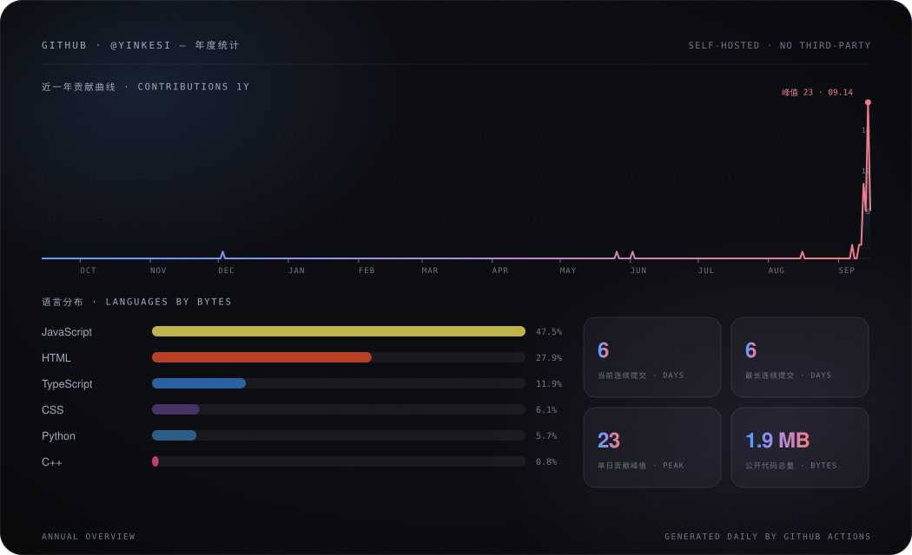

<h1 align="center">你好，我是 yinkesi 👋</h1>

  测绘与地理信息学院在读 · GIS / 遥感 / 地理数据可视化 · 数学建模 · 深度学习路上

  

- 🎓 测绘与地理信息学院 在读
- 🛰 兴趣方向：GIS / 遥感 / 地理数据可视化
- 🤖 正在跟着 nanoGPT · makemore · annotated-transformer 学深度学习
- 🏛 备战 CUMCM 2026 数学建模
- 📮 找我：[GitHub Issues](https://github.com/yinkesi/yinkesi/issues)

## 🛰 数据总览

## 📈 GitHub 统计

  

  

## 📌 精选仓库

<!-- repos:start -->
| 仓库 | 简介 | 语言 | ⭐ |
| --- | --- | --- | --- |
| **[shiji-madao](https://github.com/yinkesi/shiji-madao)** | 《实验史记·马刀风云》：据《实验史记》卷八《马刀书》改编的回合制战棋。单文件 HTML，双击即玩。 |  | 1 |
| **[dsh-new-designed-ui](https://github.com/yinkesi/dsh-new-designed-ui)** | Yinkesi — a removable, pure-white Claude-style skin for DeepSeek Harness Web |  | 1 |
| **[wechat-analysis](https://github.com/yinkesi/wechat-analysis)** | — |  | 0 |
| **[lumen-translate](https://github.com/yinkesi/lumen-translate)** | 苹果风格划词翻译浏览器扩展 · Chrome/Edge MV3 · 多引擎自动降级 · 零依赖 |  | 0 |

<!-- repos:end -->

## 🧾 最近动态

<!-- events:start -->
- `09.14` 推送 1 个提交至 **[yinkesi/yinkesi](https://github.com/yinkesi/yinkesi)**
- `09.14` 推送 1 个提交至 **[yinkesi/shiji-madao](https://github.com/yinkesi/shiji-madao)**
- `09.14` 开源了 **[yinkesi/wechat-analysis](https://github.com/yinkesi/wechat-analysis)**
- `09.12` 推送 1 个提交至 **[yinkesi/lumen-translate](https://github.com/yinkesi/lumen-translate)**
- `09.11` 推送 1 个提交至 **[yinkesi/gptchat](https://github.com/yinkesi/gptchat)**
<!-- events:end -->

<!-- quote:start -->

每日一句 · Daily Quote

> 「闲暇阅几页，读几篇书。」 —— 精卫（关中王进行曲）

<!-- quote:end -->
