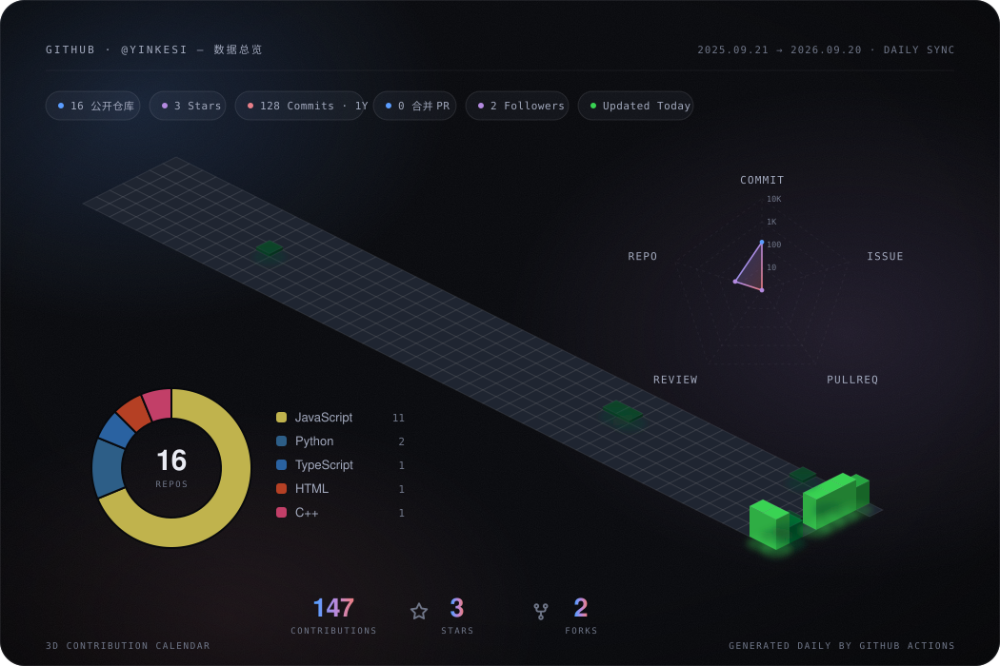

# GitHub 数据

<!-- stats:start -->

8 公开仓库 · 2 Public Stars · 30 过去一年 Commits · 0 合并 PR · 2 Followers

<!-- stats:end -->

由 GitHub Actions 每日从 GitHub API 获取并更新

<!-- badges:start -->
   
<!-- badges:end -->

## 📦 3D Contribution Calendar

<!-- quote:start -->

每日一句

> 「被清风忽略花开得犹豫不决，独徘徊等你等你的一切。」 —— 咏春

<!-- quote:end -->
